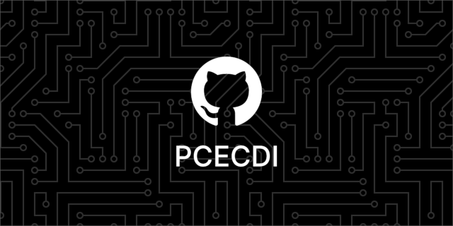

<p align="center">
  
</p>
<p align="center">A Small Program for Student Classification</p>
<p align="center">This little program will help anyone who wants to be able to classify people coming to a college place or organization. It allows you to register based on your last name, first name and class as well as choosing a reason ! I created this program at home, to train for future bigger projects.<br>If you have questions about anything check the official PCECDI wiki : <a href="https://github.com/PCECDI/PCECDI/wiki">https://github.com/PCECDI/PCECDI/wiki</a></p>

---
## Build from Sources

To build PCECDI from source, follow the steps below:

### Windows :

For building the application on Windows you must use [Qt Creator](https://www.qt.io/download-open-source).

### Linux :

#### Prerequisites

Make sure you have the following installed on your system:

- **Qt 6**: Download and install from the [Qt website](https://www.qt.io/download-open-source). or install with :
```bash
sudo apt install qt6-base-dev qt6-tools-dev cmake g++
```
- **CMake**: Version 3.5 or higher.
- **A C++ compiler**: Use a compiler compatible with your operating system (GCC for Linux, MinGW or MSVC for Windows).

#### Cloning the Repository

1. Open your terminal.
2. Clone the PCECDI repository:
```bash
git clone https://github.com/PCECDI/PCECDI.git
```
3. Navigate to the cloned directory:
```bash
cd PCECDI
```

#### Building the Application

1. Create a build directory:
```bash
mkdir build && cd build
```
2. Configure and build the project with CMake:
```bash
cmake .. && cmake --build .
```
3. Optionnal : Clean up :
```bash
find . ! -name 'translations' ! -name 'PCECDI' -exec rm -rf {} +
```
4. Once the build is complete, the executable can be found in the `build` directory.

On Windows or Linux, you may also use Qt Creator to build the project by opening the generated project file in the IDE.

---
### Running the Application

You can launch the application directly from the build directory by executing the executable file. If you are using Qt Creator, you can simply run the project from the IDE.

---
## Installing the program

Official releases of PCECDI are available as direct downloads from [GitHub](https://github.com/Turreterror42/PCECDI/releases/latest). Then extract the zip that you just downloaded and launch the executable !

---
## Licence

### Scope

This licensing document pertains to:

- Official PCECDI releases

- The PCECDI owned branch of the repositories on
  https://github.com/PCECDI/PCECDI including all their ancestor commits

### Licensing Grant

All source code files and all the artwork (as defined by the respective license) in scope of this document are under the [GPL version 3](https://www.gnu.org/licenses/gpl-3.0.html)
or any later version, at your choice.

The relevant license is provided in the [COPYING](COPYING) file in this
package.

**_TheGordonFreeman42_**